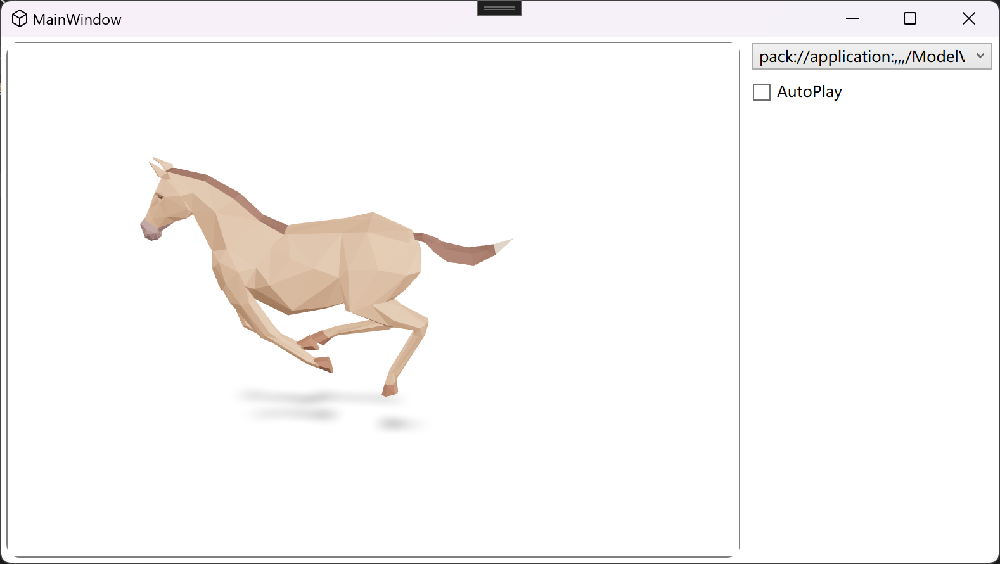

# ModelViewerWPF

ModelViewerWPF is a WPF control that uses WebView2 to display 3D models within a WPF application. 
This control is based on the [model-viewer](https://modelviewer.dev/) and supports *.gltf and *.glb formats.

## Features

- Display 3D models using WebView2
- Supports GLB/GLTF 3D model formats



## Installation

You can install [ModelViewerWPF](https://www.nuget.org/packages/ModelViewerWPF/) via the NuGet Package Manager:

```powershell
Install-Package ModelViewerWPF
```

Simple Usage

```xaml
<Window
    x:Class="YourNamespace.MainWindow"
    xmlns="http://schemas.microsoft.com/winfx/2006/xaml/presentation"
    xmlns:x="http://schemas.microsoft.com/winfx/2006/xaml"
    xmlns:modelviewer="clr-namespace:ModelViewerWPF;assembly=ModelViewerWPF"
    Title="MainWindow"
    Width="800"
    Height="450">
    <Grid>
        <modelviewer:ModelViewer
            Margin="4"
            ModelSource="Assets/Models/Horse.glb" />
    </Grid>
</Window>
```